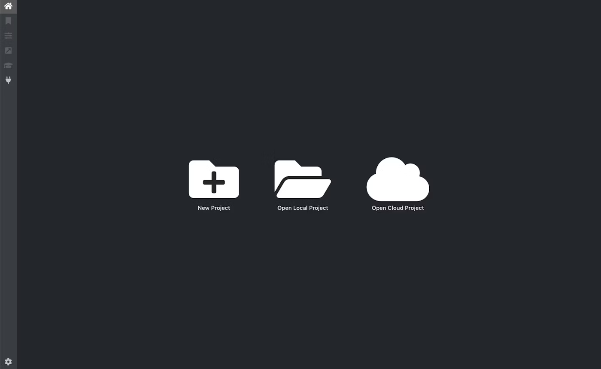
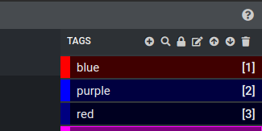
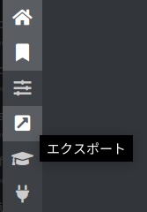
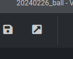

# Vottの導入
## Windows
[このリンク](https://github.com/microsoft/VoTT/releases/download/v2.2.0/vott-2.2.0-win32.exe)からダウンロードしてね
## Ubuntu
[このリンク](https://masaki-note.com/2021/04/30/vott-install/)を見ながらやってね

# セットアップ
## プロジェクトの作成
VoTT を起動すると以下のような画面が表示されるので、[New Project] を選択する。

## プロジェクトの設定
- 表示名: {Your_name}_grobo1
- ソース接続 (下記を参照)
- ターゲット接続 (下記を参照)
- 説明: なし
- フレーム抽出率: 30
- タグ: blue, red, purple
- セキュリティ トークン: Generate New Security Token

### ソース接続(対象の動画を入れたフォルダを用意してね)
1. Add Connectionを選ぶ
   - 表示名: Media
   - 説明: なし
2. プロバイダー
   1. ローカル ファイルシステム
   2. フォルダーを選択
   3. 動画の入ったフォルダを選んでね
3. 接続を保存
4. Select Connectionを押してさっき登録した表示名を選んでね

### ターゲット接続(出力先のフォルダーを用意してね)
1. Add Connectionを選ぶ
   - 表示名: OutPut
   - 説明: なし
2. プロバイダー
   1. ローカル ファイルシステム
   2. フォルダーを選択
   3. 出力先のフォルダを選んでね
3. 接続を保存
4. Select Connectionを押してさっき登録した表示名を選んでね

# アノテーション
1. 
2. ラベリングしたいタグを選ぶ
   - 鍵マークを押すと自動的にタグが付与されるようになるよ
   - タグ名の左にある色のついた四角を押したあとに鉛筆っぽいマークを押すと色を変えられるよ
3. 画像上をドラッグすると範囲を選べるよ
4. Sキーか↓を押すと次の画像に進むよ

# 出力

1. ここを押して設定をする
   - プロバイダー: Pascal VOC
   - アセットの状態: 訪問済みのアセットのみ
   - テスト/トレーニング分割: 80くらいでいいよ
   - 未割り当てをエクスポート: OFFにしてね
2. エクスポート設定を保存
3.
    
   これを押してね。
   待ってたら終わる。

